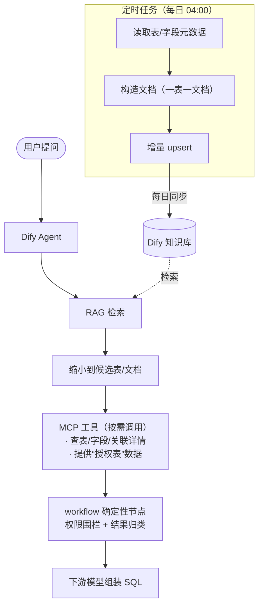
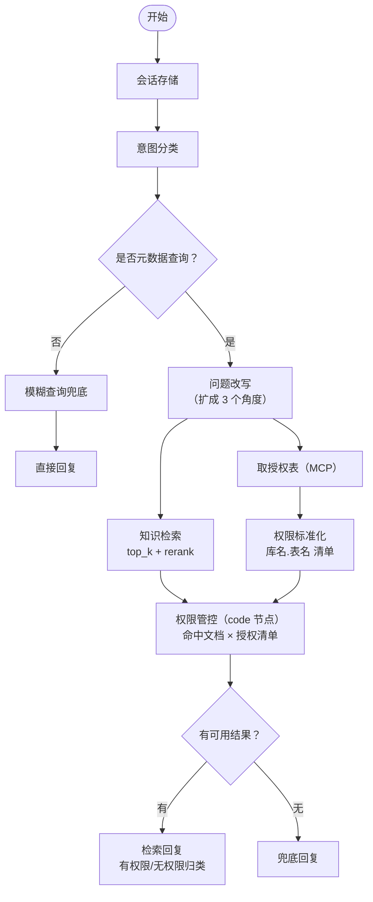

本篇主要是分享一下在 大量数据表 下通过 dify + 简单 LLM , 实现 自然语言 -> SQL 查询的一个实现思路. 

这个思路的实现门槛较低, 我们所有需要做的只是： 

1. 配置一个通用的LLM（比如 qwen3.7-plus）
2. 维护一套知识库, 用于 RAG 检索（比如 dify）
3. 开发一组 MCP 工具, 用于暴露 权限围栏 与 LLM 需要使用的 Tools . 

<!-- more -->


> 本文中的凭证、内部服务地址、内部模型名、人名等均已脱敏,业务示例保留了通用的业务语义. 
> 这个方案并不与特定的业务绑定, 可以视为一种简单的通用方案. 

---

## 一、需求背景

我们接管了**大量数据表**,并且这些表的信息(表结构、字段含义、枚举定义)**每天都在维护、变化**. 围绕这批表,业务侧和下游的诉求很朴素:

- 我想知道"某个字段有哪些关联的表",而不是去翻几百张数据字典;
- 我想知道"某给表的某给状态码是什么意思",而不是去追着表负责人问;
- 最终,我希望用一句自然语言,就能定位到正确的表和字段,进而组装出可执行的 SQL. 

传统做法的痛点很清楚:

1. **人肉翻字典**:表一多,靠人记不住、找不全;
2. **依赖数仓同学**:每次问数都要转一手,慢;
3. **字典易过时**:表天天变,任何"固化"下来的知识第二天就可能失效. 

所以我们要的不是一个一次性的问答玩具,而是一套**能跟上每日变更、可长期维护** 的自然语言找数能力.  

它的完整目标是 **NL → SQL**;本文展示的"案例A"是这套底座上已经跑通的一个中间案例,用来证明 **「自然语言 → 定位到表 → 问答」** 这条链路是可行的. 

---

## 二、实现方案与对比

最初我们打算毕全功于一役, 制定这样的一套 workflow , 这套工作流简单点描述如下：

1. 将 表的元信息 与 用户的查询诉求 放在同一套上下文中, 这样直接在一轮对话中就能够完成表的过滤
2. 根据表再取到更深层的字段与样例数据信息, 然后进一步组织 SQL

在小样本的测试上这套 workflow 表现很好, 但是随着将正式环境的数千张数据表导入进来, 随着上下文体积的膨胀, 幻觉也愈发严重. 

于是我们开始探索一些更加深入的方案. 

### 方案 A:微调模型(概念对比)

把库表 schema、字段含义、枚举知识,通过微调固化进模型权重,让模型"记住"你的数据资产,直接生成 SQL. 

- 优点:推理时不需要外部检索,端到端简洁. 
- 致命问题(对我们的场景):
  - **表规模大**:全量 schema 塞进训练样本,成本高、覆盖难;
  - **每日变更**:表信息天天变,微调是"批处理式"的知识固化,追不上日更节奏——今天微调好,明天字段一改就又过时;
  - **训练/维护成本高**:每次数据资产变化都要重新准备样本、重训、评估、上线;
  - **幻觉不可控**:模型"记"错了字段名或枚举值,你很难定位和纠正. 

### 方案 B(本方案):大量数据表 + 简单 Prompt + Dify Agent + 定时任务

不把知识塞进模型权重,而是把知识**留在外部知识库里**,让模型在推理时"现查现用":

- **定时任务**每天把最新的表/字段元数据同步进 Dify 知识库;
- **Dify Agent** 用简单的 Prompt 做意图识别、问题改写、RAG 检索缩候选;
- **MCP 工具**按需补全表/字段/关联的详情,并提供权限数据;
- 下游模型基于这些**授权范围内**的准确信息组装 SQL. 

### 对比

| 维度 | 微调模型(A) | 本方案(B) |
|---|---|---|
| 大表规模适配 | 样本准备成本高 | 知识库天然可扩,增量同步 |
| 每日变更跟随 | 差,需重训 | **好,定时同步即跟上** |
| 训练/维护成本 | 高(每次变更重训) | **低(改文档 / 跑同步)** |
| 可复现性 | 依赖训练资源与经验 | **高,一套工程即可搭起** |
| 可迁移性 | 换数据域需重训 | **高,换知识库内容即可** |
| 幻觉可控性 | 难定位 | 检索命中可溯源,权限可卡 |

**结论**:因为我们的表又多、又天天变,微调在成本和时效上都追不上. 本方案更灵活、成本更低、且可以被轻松复现和迁移,这是我们选它的核心原因. 

---

## 三、技术结构

### 3.1 整体架构



一句话:**用户提问 → Dify RAG 缩候选 → MCP 补全详情 & 提供权限数据 → workflow 卡围栏 → 下游模型组装 SQL**. 

### 3.2 MCP 工具清单

我们用 FastAPI 写普通的 HTTP 端点,再通过 `FastApiMCP` 一键挂载为 MCP 工具(走 SSE),这样任何支持 MCP 的客户端(包括写 SQL 的 AI 助手、Dify Agent)都能调用. 工具围绕"查表 / 查字段 / 查关系 / 查权限"四类:

| 工具 | 用途 |
|---|---|
| `get_all_table_and_name` | 按用户问题(可选带字段名)召回候选表的 (库名, 表名, 表备注) |
| `get_all_field_and_remark` | 查指定表的所有字段名/中文名/备注/字段知识 |
| `get_multi_table_field_and_remark` | 一次查多张表的字段信息 |
| `filter_tables_by_user_id` | 过滤出用户有权限的那部分表 |
| `get_all_tables_by_user_id` | 拉取用户全部授权表 |

#### 关于 权限 与 安全

我们需要解决的另一个问题就是, 不同的用户拥有的表不同. 

从用户的角度来说, 有些用户可能只在特定的业务维度上有表, 有些用户则可能跨维度拥有很多的表. 

从表的角度来说, 我们维护的业务表保密等级不同.  有些表虽然用户没有权限, 但是能够知道要找的数据在这些表里, 继而去申请权限；但是还有些保密等级较高的表, 如果用户没有权限, 则半点信息都不能透露给他. 

为此我们做了如下的设计：

**关于权限**:MCP 侧负责"**查**"——把用户被授权的表清单作为数据返回;真正的"**卡**"(围栏限制)放在调用方的确定性逻辑里(见 3.5). 这是刻意的安全设计:**权限判断不交给 Agent/LLM,避免被 prompt 注入绕过**. 凡是返回数据的工具,都会先与"该用户的授权表"取交集,再返回. 

此外通过双循环权限判定流程, 保证 LLM 工作效果不会因为权限限制而出现过多的损失. 

> 附带一个小设计:传入的 `user_id` 是对称加密后的字符串,由一个装饰器在进入业务逻辑前统一解密还原成整型 id,避免明文 id 在链路上裸奔. 

### 3.3 知识库如何管理

知识库由一个 **Celery 定时任务** 维护,每天凌晨同步一次:

1. 从元数据库读出全部表 + 每张表的字段;
2. **一张表 = 一篇文档**,文档名用表 id 补零(比如我们目前维护了数千张表, 所以就使用 `0042` 这样的四位 id ), 相比自增id, 寻址更加稳定;
3. **增量更新**:同步前先取回 Dify 里已有文档的分块内容做比对,内容没变就跳过,只对变化的表做"删除 + 重建", 这一步大大提高了更新效率, 并且节省了很多的 embedding 成本;
4. 批量执行时做限速, 这一点主要是出于 dify 与 跟下层的 embedding 接口 吞吐量考虑.

这样"表天天变"就变成了"知识库每天自动跟上",维护成本几乎为零. 


### 3.4 知识文档如何组成

每篇文档分两部分:

**(1) 元数据 —— 供 Dify 过滤检索用**

同步时给每篇文档写入三个元数据字段:

- `security_level`(安全级别)
- `table_schema`(库名)
- `table_name`(表名)

Dify 检索时可以基于这些字段做**元数据过滤**,让召回更精准、也为后续权限归类提供结构化依据. 

**(2) 正文 —— 双来源自动补全,人工优先**

正文是给模型看的、可读的 Markdown. 它由两个来源共同维护,并按优先级合并:

- **a. 人工维护**:表负责人在**数据管理中心**手动填写/校准字段中文名、备注、枚举定义等业务语义;
- **b. 自动更新**:系统通过**建表 DDL、ETL 代码、抽样数据**自动解析并回填表/字段信息,解决覆盖率与冷启动问题. 

**优先级规则**:同一字段若被人工维护过,则人工内容优先级更高,自动更新不覆盖人工结果;人工未覆盖的部分由自动更新兜底. 这样既保留了人工标注的准确性,又用自动化补齐了长尾. 

> 这条"读代码 / 读数据自动补全 + 人工优先"的机制,与业界头部数据 Agent 的做法一致(用离线任务读取生成表的流水线代码来丰富表描述). 它把"靠人肉全量维护字典"降级为"人工只做审校",从根本上解决了覆盖率与新表冷启动问题——这也是本方案当前**已经具备**的能力,而非规划项. 

正文示例:

```markdown
## 表信息
数据库名 (Schema): <schema>
表名: <table_name>
表中文名: <中文名>

## 字段信息
1. 字段名 (英文): status
   字段名 (中文): 状态
   字段备注: 上市状态
   枚举配置: 正常上市: 0; 暂停上市: 1
2. ...
```

字段的中文名、备注、枚举定义,正是自然语言找数最依赖的"语义桥梁"——业务问"暂停上市的企业",模型能靠枚举配置对上 `status = 1`. 

### 3.5 Dify Agent 工作流(以「案例 A」为例)

节点编排:



关键节点与 **Prompt 节选**(已脱敏):

**① 意图分类**(判断是否属于"元数据查询",结构化输出 JSON):

```text
## Role
元数据意图识别专家
## Core Task
精准判断用户查询是否属于"元数据查询"(metadata_query)...
## Output Format
{ "main_intent": "metadata_query/other", "confidence": 0.0-1.0, "explanation": "..." }
```

**② 问题改写**(把简短问题扩成 3 个不同角度,提升 RAG 召回质量):

```text
## 角色
数据库查询优化专家,将简短查询扩充为 3 个不同角度的完整查询,
匹配知识库维度(库名、表中英文、字段中英文、字段备注、枚举值). 
## 核心规则
1. 提取核心实体(表/字段/术语/枚举值),3 个问题角度不重复
2. 每个问题含:核心实体 + 至少 1 个知识库维度 + 业务场景
```

**③ 知识检索**:对接同步好的知识库,`top_k` 召回 + rerank(混合检索,关键词 + 向量各占权重). 

**④ 权限管控(code 节点,确定性逻辑)**:这是围栏真正落地的地方. 

- 输入 1:知识检索命中的文档(含元数据里的 `table_schema` / `table_name`);
- 输入 2:MCP 工具返回并标准化后的"用户授权表清单"(`库名.表名` 列表);
- 逻辑:把召回文档的 `库名.表名` 与授权清单做匹配,分成**有权限 / 无权限**两类,只把有权限的内容交给下游作答,无权限的仅提示"存在但无访问权限,请联系负责人申请". 

> 再次强调设计取舍:**MCP 提供权限数据,workflow 的 code 节点做实际围栏,不依赖 Agent 判断**. 因为 LLM 可能被诱导"放行",而确定性代码不会. 

**⑤ 检索回复**(把有/无权限结果整理成固定格式回答):

```text
# role:严谨的业务查询专家
# goal:基于 RAG 检索结果,精准归纳"有权限""无权限"两类信息,
        字段(英文名+中文名)整体加粗,字段与枚举值对应清晰. 
# constraints:
1. 不编造任何信息,不回答与提问无关的内容. 
2. 字段与枚举值严格绑定,不单独罗列枚举值. 
```

### 3.6 反馈截流(为后续训练积累素材)

根据用户对每一轮问答的使用体验,我们把被**点赞**的对话轮次截流保存下来,作为后续的训练/优化材料:

- 点赞代表"这一轮的问题 → 命中表/字段 → 回答"是一条可信链路;
- 这些高质量样本沉淀为语料,可用于后续的少样本示例、检索质量评估,乃至进一步的模型优化;
- 相比把全部历史对话一股脑喂进去,**只保留点赞样本**能有效过滤噪声,保证素材质量. 

---

## 四、效果

我们跑通了 **「自然语言 → 定位到表 → 问答」** 这条链路:

- 业务能直接用自然语言问"某个表的某个状态码是什么意思, 并横向比对其他的表",拿到**带权限过滤**的、可溯源的表/字段/枚举答案;
- 知识库靠定时任务每天自动跟上表的变更,**无需重训、几乎零维护成本**;
- 权限在确定性节点强约束,**不会因为模型被诱导而越权**. 

更重要的是,它验证了整套 **NL → SQL 能力底座**的可行性:同样的"大量数据表 + 简单 Prompt + Dify Agent + 定时任务"路径,不依赖昂贵的微调,**可以低成本复现,并迁移到任意数据域**——换掉知识库内容和权限源,这套方案就能服务另一批表、另一个业务. 

---

## 五、后续考虑发展的方向

在跑通"自然语言 → 定位到表 → 问答"之后,我们规划了几条继续演进的方向:

- **Memory(记忆层)**:目前每次问答是无状态的,每轮都从零开始. 后续引入 Memory,把用户在对话中的**纠正与偏好**(如"这个口径应该用那张表""某枚举的业务含义")保存下来,并叠加到检索结果之上,让 Agent 从更准确的基线出发,而不是重复过去的错误. 可按**全局 / 个人**两级生效. 
- **可信查询排序**:把历史 SQL 按可信度排序(高频看板 / 数据科学家编写的查询优先,一次性探索查询降权),只将高质量查询作为检索素材与 few-shot 范例,提升下游组装 SQL 的质量. 
- **执行 + 自检闭环**:从"定位表 + 问答"进一步推进到 **NL → SQL** 主线——由 Agent 生成 SQL、执行、检查结果并自动修正,最终返回经过验证的答案. 
